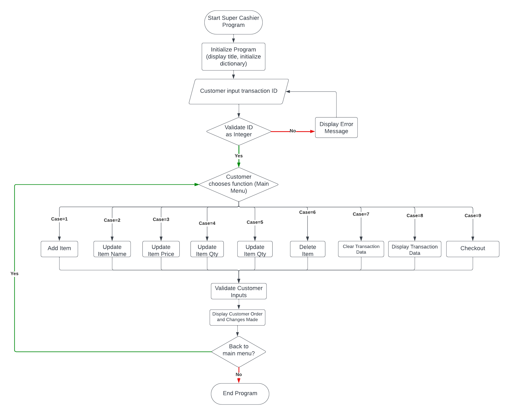
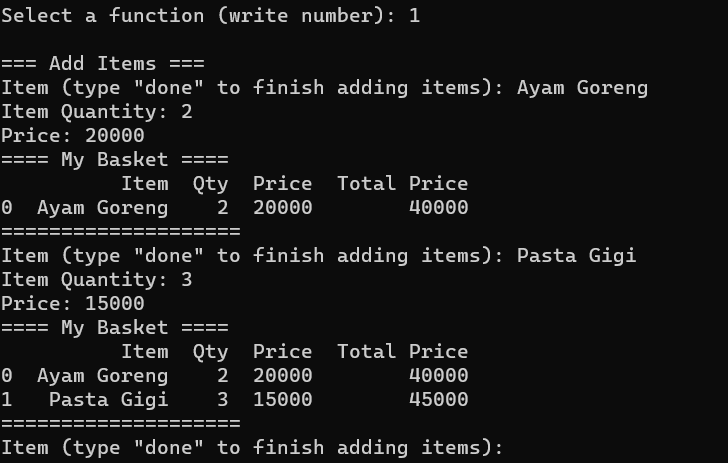
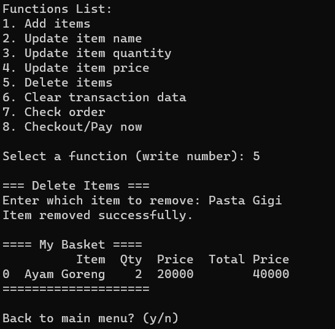
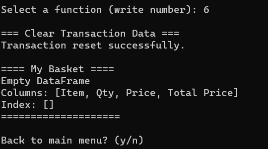
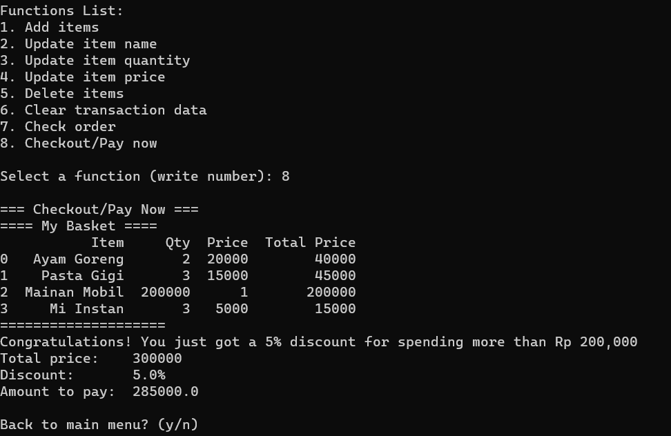

# Super Cashier

## Project Overview
Super Cashier is a Python program that simulates a cashier system, allowing users to manage transactions by adding, updating, and deleting items. It provides features such as calculating total prices, applying discounts, and checking order details. This project is intended as a learning project to learn Object Oriented Programming (OOP) using Python.

## Business Understanding
### Problem Understanding
- How to increase sales by reaching out customers outside of town?
- How do you minimize labor cost and alocate the resource elsewhere?

### Goals
- Create a self service system, which doesn't require manual labor.
- Increase customer reach and business exposure outside of town.

# Objective
Create a CRUD (Create - Read - Update Delete) program.

## Technical and Features Requirements
- <b>Create</b>
    - Customer create a trx ID.
    - Customers can add the item name, quantity, and price per item, and the system will automatically calculate the total price based on the quantity multiplied by the price per item.
- <b>Read</b>
    - Customer can view the transaction order data.
    - Customer can perform checks on the transaction order created.
    - Customer can view the total amount to be paid.
- <b>Update</b>
    - Customer can modify the item name previously added.
    - Customer can update the quantity of the previously added item.
    - Customer can update the price of the previously added item.
- <b>Delete</b>
    - Customer can delete a specific item from the transaction order.
    - Customer can quickly delete all items from the transaction order.
 
# Technical Explanations
This project consists of <b> 2 python files. </b>
- main.py is an executable file to run Super Cashier program.
- modul.py contains classes, functions, attributes used in the Super Cashier program.

## Flowchart

# Test Case
Test Cases made to make sure the program met the expected requirements which was stated in <b> Technical and Features Requirements </b> above.

## Test Case 1
Customer added 2 items with *add_item()* method.
    - Item: Ayam Goreng, Qty: 2 dan Price: 20000
    - Item: Pasta Gigi, Qty: 3 dan Price: 15000
 

 

## Test Case 2
Customer wrongfully added items, thus use *delete_item()* method to remove "Pasta Gigi" from the order.
 
 

## Test Case 3
Customer wanted to delete all transactions data. Use *reset_transaction()* method.
 

 

## Test Case 4
Customer finsihed shopping and wanted to checkout all the items they bought. Use *total_price()* method.
 

 

